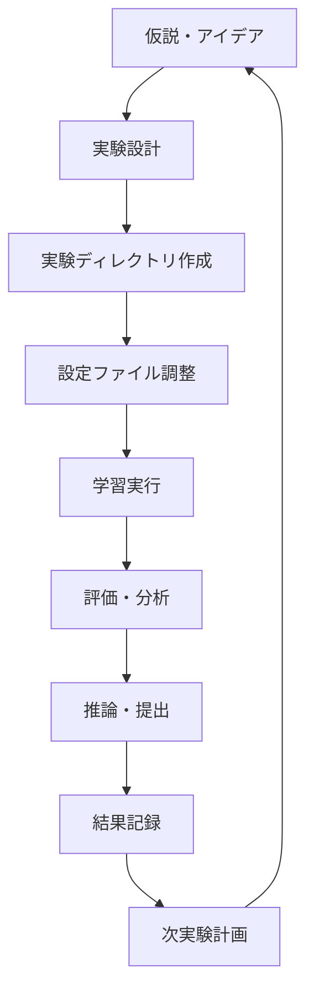

# 実験ワークフローガイド - RSNA Aneurysm Detection

## 🔄 実験ライフサイクル概要



## 1️⃣ 実験設計・計画フェーズ

### 1.1 新実験アイデアの整理

```markdown
# 実験アイデア・仮説シート

## 実験ID: exp0002
## 仮説
データ拡張を強化することで、医療画像の汎化性能が向上し、CV AUC 0.85+ を達成できる

## 変更点
- CLAHE（Contrast Limited Adaptive Histogram Equalization）を追加
- Elastic Transform を追加  
- 拡張強度を light → medium に変更

## 期待される効果
- 画像のコントラスト改善により特徴抽出の精度向上
- 形状変形による汎化性能の向上
- CV AUC: 0.8300 → 0.8500 (目標)

## リスク
- 過度な変形により医学的特徴が失われる可能性
- 学習時間の増加

## 成功基準
- CV AUC > 0.84
- CV-LB相関の維持 (r > 0.7)
- Fold間スコア標準偏差 < 0.02
```

### 1.2 新実験ディレクトリ作成

```bash
# 新実験ディレクトリ作成
mkdir experiments/exp0002

# ベース実験からのコピー
cp -r experiments/exp0001/{training.ipynb,evaluation.ipynb,inference.ipynb,env} experiments/exp0002/

# 設定ファイルのコピーと調整
cp experiments/exp0001/config.yaml experiments/exp0002/config.yaml
```

### 1.3 設定差分の決定

```yaml
# experiments/exp0002/config.yaml
experiment:
  id: exp0002
  description: "Enhanced augmentation with CLAHE and elastic transforms"
  hypothesis: "Stronger augmentation improves generalization for medical images"

augmentation:
  strength: "medium"  # light → medium
  train_transforms:
    - CLAHE: {clip_limit: 3.0, tile_grid_size: [8, 8], p: 0.5}  # 新規追加
    - ElasticTransform: {alpha: 30, sigma: 5, p: 0.3}  # 新規追加
    # 既存の設定は継承
```

## 2️⃣ データ準備・CV分割固定フェーズ

### 2.1 交差検証分割の作成

```python
# CV分割を作成・固定
from sklearn.model_selection import StratifiedGroupKFold
import pandas as pd

def create_cv_splits(train_df, config):
    """CV分割を作成して保存"""
    
    sgkf = StratifiedGroupKFold(
        n_splits=config['cv']['n_folds'],
        shuffle=True,
        random_state=config['cv']['seed']
    )
    
    train_df['fold'] = -1
    for fold, (train_idx, val_idx) in enumerate(
        sgkf.split(
            train_df,
            train_df[config['data']['target_column']],
            train_df[config['cv']['group_column']]
        )
    ):
        train_df.loc[val_idx, 'fold'] = fold
    
    # CV分割保存
    cv_splits_df = train_df[['PatientID', 'fold', config['data']['target_column']]].copy()
    cv_splits_df.to_csv('cv_folds.csv', index=False)
    
    return train_df

# 分割品質チェック
def validate_cv_splits(train_df, target_col, group_col):
    """CV分割の品質をチェック"""
    
    fold_stats = []
    for fold in range(5):
        fold_data = train_df[train_df['fold'] == fold]
        
        stats = {
            'fold': fold,
            'n_samples': len(fold_data),
            'n_patients': fold_data[group_col].nunique(),
            'positive_rate': fold_data[target_col].mean(),
            'n_positive': fold_data[target_col].sum()
        }
        fold_stats.append(stats)
    
    fold_df = pd.DataFrame(fold_stats)
    
    # 品質チェック
    pos_rate_std = fold_df['positive_rate'].std()
    sample_size_cv = fold_df['n_samples'].std() / fold_df['n_samples'].mean()
    
    print("CV Splits Quality Check:")
    print(f"Positive rate std: {pos_rate_std:.4f} (<0.05 is good)")
    print(f"Sample size CV: {sample_size_cv:.4f} (<0.1 is good)")
    
    return fold_df
```

### 2.2 データ品質監査

```python
def audit_data_quality(train_df, test_df):
    """データ品質監査"""
    
    print("Data Quality Audit")
    print("=" * 50)
    
    # 基本統計
    print(f"Training samples: {len(train_df)}")
    print(f"Test samples: {len(test_df)}")
    print(f"Positive rate: {train_df['aneurysm'].mean():.4f}")
    
    # 重複チェック
    train_duplicates = train_df.duplicated().sum()
    test_duplicates = test_df.duplicated().sum()
    print(f"Training duplicates: {train_duplicates}")
    print(f"Test duplicates: {test_duplicates}")
    
    # 欠損値チェック
    train_missing = train_df.isnull().sum()
    test_missing = test_df.isnull().sum()
    print(f"Training missing values:\n{train_missing[train_missing > 0]}")
    print(f"Test missing values:\n{test_missing[test_missing > 0]}")
    
    # データ分布比較（可能な場合）
    common_cols = set(train_df.columns) & set(test_df.columns) - {'aneurysm'}
    for col in common_cols:
        if train_df[col].dtype in ['int64', 'float64']:
            train_mean = train_df[col].mean()
            test_mean = test_df[col].mean()
            diff = abs(train_mean - test_mean) / train_mean if train_mean != 0 else 0
            if diff > 0.1:  # 10%以上の差
                print(f"⚠️ Distribution shift in {col}: train={train_mean:.3f}, test={test_mean:.3f}")
```

## 3️⃣ 学習実行フェーズ（training.ipynb）

### 3.1 実験メタデータ記録

```python
import wandb
import subprocess
from datetime import datetime

def initialize_experiment(config):
    """実験初期化"""
    
    # Git SHA記録
    git_sha = subprocess.check_output(['git', 'rev-parse', 'HEAD']).decode('ascii').strip()
    
    # W&B初期化
    run = wandb.init(
        project=config['logging']['wandb']['project'],
        name=config['logging']['wandb']['name'],
        config=config,
        tags=config['logging']['wandb']['tags'],
        notes=config['experiment']['hypothesis']
    )
    
    # 実験メタデータ保存
    experiment_metadata = {
        'experiment_id': config['experiment']['id'],
        'start_time': datetime.now().isoformat(),
        'git_sha': git_sha,
        'git_branch': subprocess.check_output(['git', 'branch', '--show-current']).decode().strip(),
        'wandb_run_id': run.id,
        'wandb_url': f"https://wandb.ai/{run.entity}/{run.project}/runs/{run.id}",
        'hypothesis': config['experiment']['hypothesis'],
        'config_snapshot': config
    }
    
    # ファイル保存
    with open('git_sha.txt', 'w') as f:
        f.write(git_sha)
    
    with open('wandb_run.txt', 'w') as f:
        f.write(f"URL: {experiment_metadata['wandb_url']}\n")
        f.write(f"Run ID: {run.id}\n")
    
    return run, experiment_metadata
```

### 3.2 学習ループとモニタリング

```python
def train_with_monitoring(model, train_loader, valid_loader, config):
    """モニタリング機能付き学習"""
    
    # Early Stopping設定
    early_stopping = EarlyStopping(
        patience=config['train']['early_stopping']['patience'],
        mode='max',
        min_delta=0.001
    )
    
    best_score = 0
    training_history = {
        'train_loss': [],
        'val_loss': [],
        'val_auc': [],
        'learning_rate': []
    }
    
    for epoch in range(config['train']['epochs']):
        # 学習
        train_loss = train_epoch(model, train_loader, optimizer, criterion, device)
        
        # 検証
        val_loss, val_auc, val_preds, val_targets = validate_epoch(model, valid_loader, criterion, device)
        
        # 学習率更新
        scheduler.step()
        current_lr = optimizer.param_groups[0]['lr']
        
        # 履歴記録
        training_history['train_loss'].append(train_loss)
        training_history['val_loss'].append(val_loss)
        training_history['val_auc'].append(val_auc)
        training_history['learning_rate'].append(current_lr)
        
        # ログ出力
        print(f"Epoch {epoch+1}/{config['train']['epochs']}")
        print(f"Train Loss: {train_loss:.4f}, Val Loss: {val_loss:.4f}, Val AUC: {val_auc:.4f}, LR: {current_lr:.2e}")
        
        # W&B ログ
        wandb.log({
            f'fold_{fold}_train_loss': train_loss,
            f'fold_{fold}_val_loss': val_loss,
            f'fold_{fold}_val_auc': val_auc,
            'epoch': epoch,
            'learning_rate': current_lr
        })
        
        # ベストモデル保存
        if val_auc > best_score:
            best_score = val_auc
            torch.save({
                'epoch': epoch,
                'model_state_dict': model.state_dict(),
                'optimizer_state_dict': optimizer.state_dict(),
                'scheduler_state_dict': scheduler.state_dict(),
                'val_auc': val_auc,
                'val_predictions': val_preds
            }, f'model/fold_{fold}_best.pth')
            
            print(f"New best score: {val_auc:.4f}")
        
        # Early stopping チェック
        if early_stopping(val_auc, model):
            print(f"Early stopping at epoch {epoch+1}")
            break
    
    return training_history, best_score
```

### 3.3 学習完了時の成果物保存

```python
def save_training_artifacts(fold_scores, oof_predictions, oof_targets, config, training_histories):
    """学習成果物の保存"""
    
    # OOF予測保存
    oof_df = pd.DataFrame({
        'index': range(len(oof_targets)),
        'fold': oof_fold_assignments,
        'y_true': oof_targets,
        'y_pred': oof_predictions
    })
    oof_df.to_csv('oof_predictions.csv', index=False)
    
    # メトリクス計算・保存
    cv_mean = np.mean(fold_scores)
    cv_std = np.std(fold_scores)
    oof_auc = roc_auc_score(oof_targets, oof_predictions)
    
    metrics = {
        'experiment_id': config['experiment']['id'],
        'cv_mean_auc': float(cv_mean),
        'cv_std_auc': float(cv_std),
        'oof_auc': float(oof_auc),
        'fold_scores': [float(x) for x in fold_scores],
        'n_folds': len(fold_scores),
        'training_completed': datetime.now().isoformat()
    }
    
    with open('metrics.json', 'w') as f:
        json.dump(metrics, f, indent=2)
    
    # 学習履歴保存
    with open('training_history.json', 'w') as f:
        json.dump(training_histories, f, indent=2)
    
    # W&B最終ログ
    wandb.log({
        'final_cv_mean_auc': cv_mean,
        'final_cv_std_auc': cv_std,
        'final_oof_auc': oof_auc
    })
    
    print(f"Training completed! CV AUC: {cv_mean:.4f} ± {cv_std:.4f}")
    return metrics
```

## 4️⃣ OOF分析フェーズ（evaluation.ipynb）

### 4.1 基本性能分析

```python
def comprehensive_oof_analysis(oof_df, metrics):
    """包括的なOOF分析"""
    
    print("=" * 60)
    print("COMPREHENSIVE OOF ANALYSIS")
    print("=" * 60)
    
    # 基本統計
    print(f"CV Mean AUC: {metrics['cv_mean_auc']:.6f} ± {metrics['cv_std_auc']:.6f}")
    print(f"OOF AUC: {metrics['oof_auc']:.6f}")
    print(f"CV-OOF Diff: {abs(metrics['cv_mean_auc'] - metrics['oof_auc']):.6f}")
    
    # Fold別分析
    print(f"\nFold-wise Performance:")
    for i, score in enumerate(metrics['fold_scores']):
        print(f"  Fold {i+1}: {score:.6f}")
    
    # 品質チェック
    fold_std = metrics['cv_std_auc']
    cv_oof_diff = abs(metrics['cv_mean_auc'] - metrics['oof_auc'])
    
    # アラート
    if fold_std > 0.02:
        print("⚠️  WARNING: High fold variance (potential instability)")
    if cv_oof_diff > 0.01:
        print("⚠️  WARNING: Large CV-OOF discrepancy")
    
    return {
        'fold_consistency': 1 - fold_std,
        'cv_oof_agreement': 1 - cv_oof_diff,
        'overall_quality': np.mean([1 - fold_std, 1 - cv_oof_diff])
    }
```

### 4.2 リーク検出・異常値分析

```python
def detect_data_issues(oof_df, train_df):
    """データ問題の検出"""
    
    issues_found = []
    
    # 1. 異常に高い予測確率
    extreme_high = (oof_df['y_pred'] > 0.99).sum()
    extreme_low = (oof_df['y_pred'] < 0.01).sum()
    extreme_ratio = (extreme_high + extreme_low) / len(oof_df)
    
    print(f"Extreme predictions: {extreme_ratio:.2%}")
    if extreme_ratio > 0.10:
        issues_found.append("Too many extreme predictions (potential overfitting)")
    
    # 2. Fold間のTarget分布チェック
    fold_target_rates = []
    for fold in oof_df['fold'].unique():
        fold_data = oof_df[oof_df['fold'] == fold]
        target_rate = fold_data['y_true'].mean()
        fold_target_rates.append(target_rate)
    
    target_rate_std = np.std(fold_target_rates)
    print(f"Fold target rate std: {target_rate_std:.4f}")
    if target_rate_std > 0.05:
        issues_found.append("Inconsistent target distribution across folds")
    
    # 3. 予測分布のチェック
    neg_pred_mean = oof_df[oof_df['y_true'] == 0]['y_pred'].mean()
    pos_pred_mean = oof_df[oof_df['y_true'] == 1]['y_pred'].mean()
    separation = pos_pred_mean - neg_pred_mean
    
    print(f"Class separation: {separation:.4f}")
    if separation < 0.1:
        issues_found.append("Poor class separation in predictions")
    
    return issues_found

def analyze_prediction_patterns(oof_df):
    """予測パターン分析"""
    
    # 信頼度別分析
    confidence_bins = pd.cut(oof_df['y_pred'], bins=[0, 0.2, 0.4, 0.6, 0.8, 1.0], 
                           labels=['Very Low', 'Low', 'Medium', 'High', 'Very High'])
    
    confidence_analysis = oof_df.groupby(confidence_bins).agg({
        'y_true': ['count', 'mean'],
        'y_pred': 'mean'
    }).round(4)
    
    print("Prediction Confidence Analysis:")
    print(confidence_analysis)
    
    # Calibration 分析
    from sklearn.calibration import calibration_curve
    
    fraction_of_positives, mean_predicted_value = calibration_curve(
        oof_df['y_true'], oof_df['y_pred'], n_bins=10
    )
    
    calibration_error = np.mean(np.abs(fraction_of_positives - mean_predicted_value))
    print(f"\nCalibration Error: {calibration_error:.4f}")
    
    return confidence_analysis, calibration_error
```

### 4.3 閾値最適化

```python
from scripts.metrics import ThresholdOptimizer

def optimize_classification_threshold(oof_df):
    """分類閾値の最適化"""
    
    optimizer = ThresholdOptimizer(oof_df['y_true'], oof_df['y_pred'])
    
    # 複数手法で最適化
    methods = ['youden', 'f1', 'precision_recall_balance']
    threshold_results = []
    
    for method in methods:
        result = optimizer.optimize_threshold(method)
        
        # 該当閾値でのメトリクス計算
        y_pred_binary = (oof_df['y_pred'] >= result['threshold']).astype(int)
        
        metrics_at_threshold = {
            'method': method,
            'threshold': result['threshold'],
            'accuracy': accuracy_score(oof_df['y_true'], y_pred_binary),
            'f1': f1_score(oof_df['y_true'], y_pred_binary),
            'precision': precision_score(oof_df['y_true'], y_pred_binary),
            'recall': recall_score(oof_df['y_true'], y_pred_binary)
        }
        
        threshold_results.append(metrics_at_threshold)
    
    threshold_df = pd.DataFrame(threshold_results)
    
    # 推奨閾値の決定（Youden法を優先）
    recommended_threshold = threshold_df[threshold_df['method'] == 'youden']['threshold'].iloc[0]
    
    # 最適化結果を保存
    threshold_optimization = {
        'methods_comparison': threshold_df.to_dict('records'),
        'recommended_threshold': float(recommended_threshold),
        'optimization_date': datetime.now().isoformat()
    }
    
    with open('threshold_optimization.json', 'w') as f:
        json.dump(threshold_optimization, f, indent=2)
    
    return threshold_df, recommended_threshold
```

## 5️⃣ 推論・提出フェーズ（inference.ipynb）

### 5.1 テストデータ推論

```python
def inference_with_tta(models, test_loader, tta_transforms, device):
    """TTA付きアンサンブル推論"""
    
    all_predictions = []
    
    # TTA別に推論
    for tta_name, transform in tta_transforms.items():
        print(f"Running inference with TTA: {tta_name}")
        
        # データローダー再構築
        test_dataset.transform = transform
        current_loader = DataLoader(test_dataset, batch_size=32, shuffle=False)
        
        # 各モデルで予測
        tta_predictions = []
        
        for model in models:
            model.eval()
            fold_predictions = []
            
            with torch.no_grad():
                for images in tqdm(current_loader):
                    images = images.to(device)
                    
                    with torch.cuda.amp.autocast():
                        outputs = model(images)
                        probs = torch.sigmoid(outputs).cpu().numpy()
                    
                    fold_predictions.extend(probs.flatten())
            
            tta_predictions.append(fold_predictions)
        
        # モデル間アンサンブル
        ensemble_predictions = np.mean(tta_predictions, axis=0)
        all_predictions.append(ensemble_predictions)
    
    # TTA間アンサンブル
    final_predictions = np.mean(all_predictions, axis=0)
    
    return final_predictions

def create_submission_with_metadata(test_df, predictions, recommended_threshold, config):
    """メタデータ付き提出ファイル作成"""
    
    timestamp = datetime.now().strftime('%Y%m%d_%H%M%S')
    
    # 確率版
    submission_proba = test_df[['image_id']].copy()
    submission_proba['aneurysm'] = predictions
    proba_filename = f"submissions/{config['experiment']['id']}_proba_{timestamp}.csv"
    submission_proba.to_csv(proba_filename, index=False)
    
    # 二値版
    submission_binary = test_df[['image_id']].copy()
    submission_binary['aneurysm'] = (predictions >= recommended_threshold).astype(int)
    binary_filename = f"submissions/{config['experiment']['id']}_binary_th{recommended_threshold:.3f}_{timestamp}.csv"
    submission_binary.to_csv(binary_filename, index=False)
    
    # 提出メタデータ
    submission_metadata = {
        'experiment_id': config['experiment']['id'],
        'submission_time': datetime.now().isoformat(),
        'git_sha': get_git_sha(),
        'model_files': [f"model/fold_{i}_best.pth" for i in range(5)],
        'tta_enabled': True,
        'recommended_threshold': float(recommended_threshold),
        'test_samples': len(test_df),
        'predicted_positive': int((predictions >= recommended_threshold).sum()),
        'predicted_positive_rate': float((predictions >= recommended_threshold).mean()),
        'files': {
            'probability': proba_filename,
            'binary': binary_filename
        }
    }
    
    with open('submission_metadata.json', 'w') as f:
        json.dump(submission_metadata, f, indent=2)
    
    return proba_filename, binary_filename, submission_metadata
```

### 5.2 自動Kaggle提出

```python
def submit_to_kaggle_with_retry(submission_file, config, max_retries=3):
    """再試行機能付きKaggle提出"""
    
    git_sha = get_git_sha()[:8]
    message = config['kaggle']['submission_message'].format(git_sha=git_sha)
    
    for attempt in range(max_retries):
        try:
            cmd = [
                'kaggle', 'competitions', 'submit',
                '-c', config['kaggle']['competition'],
                '-f', submission_file,
                '-m', message
            ]
            
            result = subprocess.run(cmd, capture_output=True, text=True, check=True)
            
            print(f"✅ Successfully submitted to Kaggle!")
            print(f"Output: {result.stdout}")
            
            # 提出成功をログ
            wandb.log({
                'kaggle_submission_success': 1,
                'submission_attempt': attempt + 1
            })
            
            return True, result.stdout
            
        except subprocess.CalledProcessError as e:
            print(f"❌ Submission attempt {attempt + 1} failed: {e.stderr}")
            
            if attempt < max_retries - 1:
                print("Retrying in 10 seconds...")
                time.sleep(10)
            else:
                print("Manual submission required:")
                print(f"kaggle competitions submit -c {config['kaggle']['competition']} -f {submission_file} -m '{message}'")
                
                # 提出失敗をログ
                wandb.log({
                    'kaggle_submission_success': 0,
                    'submission_attempts': max_retries
                })
                
                return False, e.stderr
    
    return False, "Max retries exceeded"
```

## 6️⃣ 結果記録・次実験計画フェーズ

### 6.1 実験台帳の更新

```python
def update_experiments_log(experiment_results, lb_score=None):
    """実験台帳への結果追記"""
    
    experiments_file = "../../experiments.csv"
    
    # 実験結果行の作成
    experiment_row = {
        'exp_id': experiment_results['experiment_id'],
        'date': datetime.now().strftime('%Y-%m-%d'),
        'description': experiment_results.get('description', ''),
        'hypothesis': experiment_results.get('hypothesis', ''),
        'cv_mean_auc': experiment_results['cv_mean_auc'],
        'cv_std_auc': experiment_results['cv_std_auc'],
        'oof_auc': experiment_results['oof_auc'],
        'lb_public': lb_score if lb_score else None,
        'lb_private': None,  # コンペ終了後に更新
        'fold_consistency': experiment_results.get('fold_consistency', None),
        'cv_reliability_score': experiment_results.get('cv_reliability_score', None),
        'git_sha': get_git_sha()[:8],
        'wandb_url': experiment_results.get('wandb_url', ''),
        'model_architecture': experiment_results.get('model_architecture', ''),
        'key_changes': experiment_results.get('key_changes', ''),
        'success': experiment_results['cv_mean_auc'] > 0.80,  # 基準スコア
        'notes': ''
    }
    
    # CSV更新
    if os.path.exists(experiments_file):
        experiments_df = pd.read_csv(experiments_file)
    else:
        experiments_df = pd.DataFrame()
    
    new_row_df = pd.DataFrame([experiment_row])
    experiments_df = pd.concat([experiments_df, new_row_df], ignore_index=True)
    experiments_df.to_csv(experiments_file, index=False)
    
    print(f"Experiments log updated: {experiments_file}")
    return experiments_df
```

### 6.2 詳細な実験ノート作成

```python
def generate_experiment_notes(experiment_results, threshold_results, data_quality_issues):
    """詳細実験ノートの自動生成"""
    
    notes_template = f"""
# 実験ノート - {experiment_results['experiment_id']}

## 📊 実験サマリー
- **実験日**: {datetime.now().strftime('%Y-%m-%d')}
- **仮説**: {experiment_results.get('hypothesis', 'N/A')}
- **Git SHA**: {get_git_sha()[:8]}
- **W&B Run**: {experiment_results.get('wandb_url', 'N/A')}

## 📈 性能結果
- **CV AUC**: {experiment_results['cv_mean_auc']:.4f} ± {experiment_results['cv_std_auc']:.4f}
- **OOF AUC**: {experiment_results['oof_auc']:.4f}
- **最適閾値**: {threshold_results['recommended_threshold']:.4f} (Youden method)

### Fold別性能
"""
    
    for i, score in enumerate(experiment_results['fold_scores']):
        notes_template += f"- Fold {i+1}: {score:.4f}\n"
    
    notes_template += f"""
## 🔍 品質分析

### データ品質
"""
    
    if data_quality_issues:
        for issue in data_quality_issues:
            notes_template += f"- ⚠️ {issue}\n"
    else:
        notes_template += "- ✅ No significant data quality issues detected\n"
    
    notes_template += f"""

### モデル信頼性
- **Fold一貫性**: {experiment_results.get('fold_consistency', 'N/A')}
- **CV-OOF一致性**: {experiment_results.get('cv_oof_agreement', 'N/A')}
- **総合品質スコア**: {experiment_results.get('cv_reliability_score', 'N/A')}

## 🎯 主要な発見

### 成功点
- [実際の結果に基づいて手動で記入]

### 課題点
- [実際の結果に基づいて手動で記入]

## 🔮 次実験への示唆

### 改善アイデア
1. [実際の分析結果に基づいて記入]
2. [実際の分析結果に基づいて記入]
3. [実際の分析結果に基づいて記入]

### リスク要因
- [特定された問題点を記入]

## 📋 アクションアイテム
- [ ] [具体的な次のステップ]
- [ ] [具体的な次のステップ]
- [ ] [具体的な次のステップ]

---
*このノートは実験完了時に自動生成されました*
"""
    
    # ファイル保存
    with open('detailed_experiment_notes.md', 'w', encoding='utf-8') as f:
        f.write(notes_template)
    
    print("Detailed experiment notes saved: detailed_experiment_notes.md")
    return notes_template
```

## 🔄 継続的改善サイクル

### CV-LB相関の追跡

```python
def analyze_cv_lb_correlation(experiments_df):
    """CV-LB相関分析"""
    
    # 有効なデータのみ抽出
    valid_experiments = experiments_df.dropna(subset=['cv_mean_auc', 'lb_public'])
    
    if len(valid_experiments) < 3:
        print("Insufficient data for correlation analysis")
        return None
    
    # 相関係数計算
    correlation = valid_experiments['cv_mean_auc'].corr(valid_experiments['lb_public'])
    
    print(f"CV-LB Correlation: {correlation:.4f}")
    
    # 相関の品質判定
    if correlation > 0.8:
        print("✅ Excellent correlation - Trust your CV!")
    elif correlation > 0.6:
        print("✅ Good correlation - CV is reliable")
    elif correlation > 0.4:
        print("⚠️ Fair correlation - Some caution needed")
    else:
        print("❌ Poor correlation - Review CV strategy")
    
    # 散布図作成
    plt.figure(figsize=(10, 6))
    plt.scatter(valid_experiments['cv_mean_auc'], valid_experiments['lb_public'], 
               alpha=0.7, s=100)
    
    for _, row in valid_experiments.iterrows():
        plt.annotate(row['exp_id'], 
                    (row['cv_mean_auc'], row['lb_public']),
                    xytext=(5, 5), textcoords='offset points')
    
    plt.xlabel('CV AUC')
    plt.ylabel('LB Public AUC')
    plt.title(f'CV-LB Correlation (r={correlation:.4f})')
    plt.grid(True, alpha=0.3)
    
    # 回帰線
    z = np.polyfit(valid_experiments['cv_mean_auc'], valid_experiments['lb_public'], 1)
    p = np.poly1d(z)
    plt.plot(valid_experiments['cv_mean_auc'], p(valid_experiments['cv_mean_auc']), "r--", alpha=0.8)
    
    plt.tight_layout()
    plt.savefig('cv_lb_correlation.png', dpi=300, bbox_inches='tight')
    plt.show()
    
    return correlation
```

### 自動実験提案システム

```python
def suggest_next_experiments(experiments_df, current_best_score):
    """次実験の自動提案"""
    
    suggestions = []
    
    # 基本的な改善提案
    if current_best_score < 0.85:
        suggestions.extend([
            "Try different model architectures (EfficientNet, Vision Transformer)",
            "Experiment with advanced data augmentation",
            "Implement multi-scale training",
            "Add external data or pseudo-labeling"
        ])
    elif current_best_score < 0.90:
        suggestions.extend([
            "Ensemble multiple models",
            "Fine-tune with different learning rates",
            "Implement advanced techniques (mixup, cutmix)",
            "Optimize post-processing and thresholding"
        ])
    else:
        suggestions.extend([
            "Focus on model ensemble strategies", 
            "Implement test-time augmentation optimization",
            "Fine-tune submission strategy",
            "Investigate stacking approaches"
        ])
    
    # CV-LB相関に基づく提案
    if len(experiments_df) > 2:
        correlation = analyze_cv_lb_correlation(experiments_df)
        if correlation is not None and correlation < 0.7:
            suggestions.append("Review cross-validation strategy due to low CV-LB correlation")
    
    # 最近の傾向に基づく提案
    recent_experiments = experiments_df.tail(3)
    if len(recent_experiments) > 1:
        recent_improvement = recent_experiments['cv_mean_auc'].diff().mean()
        if recent_improvement < 0.001:
            suggestions.append("Consider more significant changes - recent improvements are minimal")
    
    print("🔮 Next Experiment Suggestions:")
    for i, suggestion in enumerate(suggestions[:5], 1):  # 上位5つ
        print(f"  {i}. {suggestion}")
    
    return suggestions
```

## 📋 実験管理チェックリスト

### 実験開始時
- [ ] 明確な仮説が定義されている
- [ ] 変更点が前実験から明確に分離されている
- [ ] CV分割が適切に固定されている
- [ ] Git commitが完了している

### 学習実行中
- [ ] W&Bログが正常に記録されている
- [ ] GPU/CPUリソースが適切に使用されている
- [ ] Early stoppingが適切に動作している
- [ ] 中間結果が定期的に保存されている

### 評価分析時
- [ ] OOF分析が完了している
- [ ] データ品質問題が検出・記録されている
- [ ] 閾値最適化が実行されている
- [ ] CV-LB相関が更新されている

### 実験完了時
- [ ] すべての成果物が適切に保存されている
- [ ] 実験台帳が更新されている
- [ ] 詳細ノートが作成されている
- [ ] 次実験のアイデアが整理されている

---

このワークフローに従うことで、体系的かつ効率的な実験管理を実現し、最高品質の機械学習モデルを構築できます。